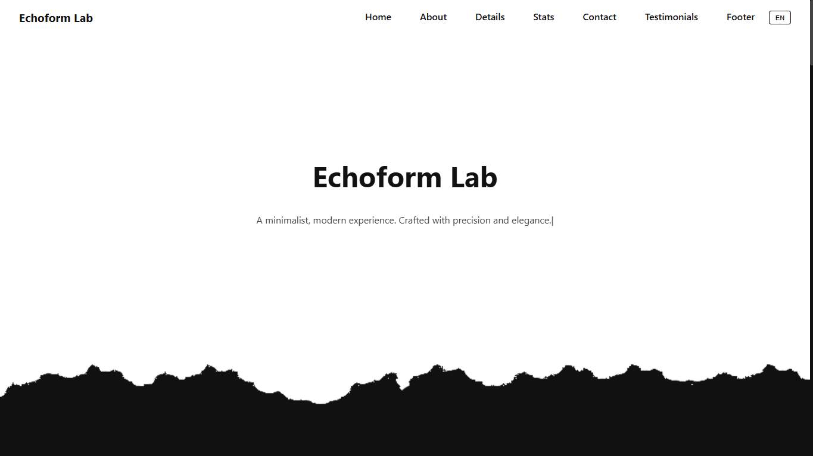
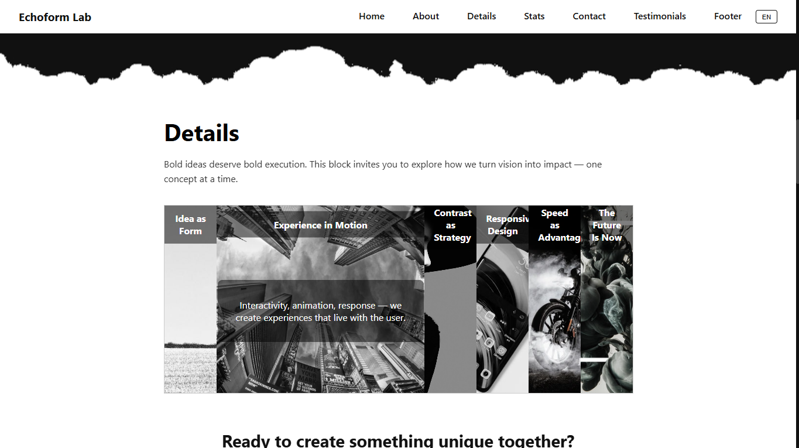
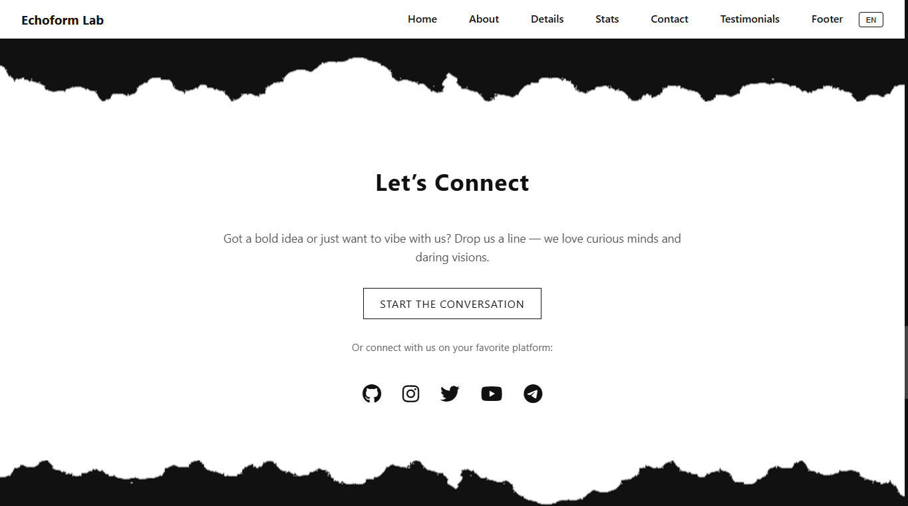
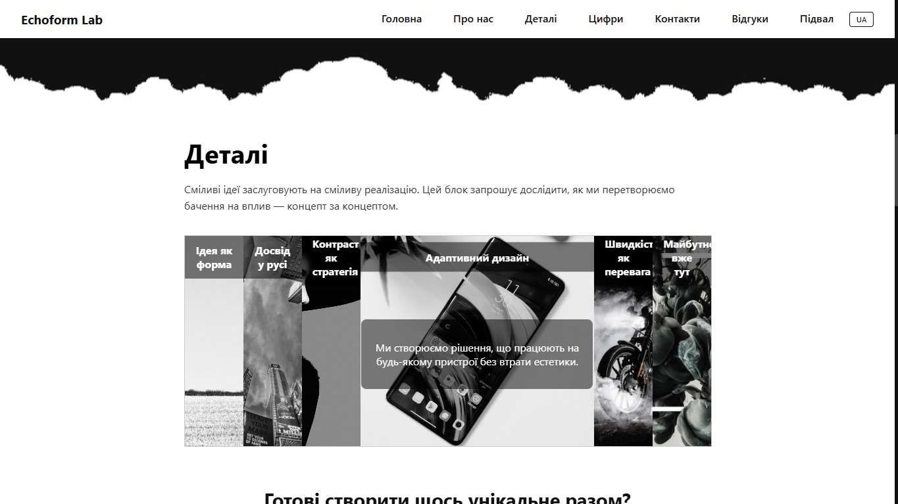

# Echoform Lab

Minimalist. Monochrome. Impactful.

Echoform Lab is a creative agency-style web experience that blends clean design, dynamic interactions, and multilingual accessibility. Built with React and Vite, it showcases a modern aesthetic with layered visuals, scroll-triggered animations, and seamless transitions.

---

## 🔗 Live Demo

👉 [View the site](https://reshatel.github.io/Echoform-Lab/)

---

## 🖼️ Preview

| | |
|:--:|:--:|
|  |  |
|  |  |

---

## ⚙️ Tech Stack

- ⚛️ **React + Vite** — fast, modular frontend architecture
- 🌍 **react-i18next** — multilingual support (English / Ukrainian)
- 🎨 **CSS Modules** — scoped styling with a monochrome palette
- 🧠 **IntersectionObserver** — scroll-triggered animations
- 🧩 **Custom sliders & accordions** — interactive UI components
- 🚀 **GitHub Pages** — static site deployment

---

## 🌐 Localization

Echoform Lab supports two languages:

- 🇬🇧 English  
- 🇺🇦 Ukrainian  

Language switching is instant and seamless, with full translation coverage across all components.

---

## 🚀 Getting Started

Clone the repository and run locally:

```bash
git clone https://github.com/Reshatel/Echoform-Lab.git
cd Echoform-Lab
npm install
npm run dev
